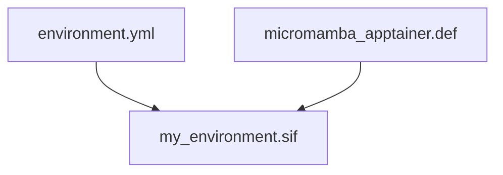

# Micromamba Apptainer

This small definition file can be used to create a conda environment in
an apptainer / singularity container.

Givent `environment.yml` is combined with the `micromamba_apptainer.def`
definition file to create a SIF-image:



## Example

Create a `environment.yml` file with all needed channels and dependencies
present. Name the environment `base`. This is important as all packages
will be installed to the base environment.

```yml
name: base
channels:
  - conda-forge
dependencies:
  - python
  - numpy
```

Create an apptainer image with the bootstrapping definition.

For `apptainer`:
```console
apptainer build my_environment.sif micromamba_apptainer.def
```

You can run ``python`` from the the image with ``apptainer run``:
```console
apptainer run my_environment.sif python -c 'import numpy as np; print(np.__version__)'
```

``apptainer run`` automatically activates the ``base``-environment.

## Singularity usage

If you're using `singularity`, just swap `apptainer` to `singularity` in all commands.
